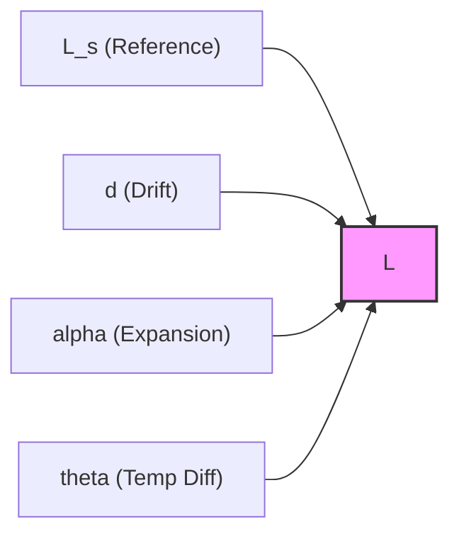

# Causal Graphs Integration

In industrial metrology, measurement models are often conceived visually as **Ishikawa (Fishbone) diagrams** or causal trees. 

`SymbolicUncertainties.jl` offers an experimental bridge to **`CausalGraphs.jl`**, enabling you to automatically ingest qualitative causal graphs and convert them into executable GUM evaluations.

## Graphical Representation (Ishikawa Diagram)

Before writing equations, you might map out the causes affecting your measurement `L`:



## Two Modes of Operation

The integration comes with two powerful tools:
1. **Scaffolding Mode (`parse_measurement_model`)**: Translates a causal graph into a ready-to-edit Julia script.
2. **Full-Auto Mode (`evaluate_measurement_model`)**: Evaluates a causal graph directly, provided the output node contains the algebraic equation in its metadata.

### 1. Scaffolding Mode

Often, you design the cause-and-effect structure of a measurement model before writing the equation. You can define your diagram in `CausalGraphs.jl`:

```julia
using SymbolicUncertainties

# Define nodes with values and uncertainties
L_s = CauseNode(:L_s, Dict(:value => 10.0, :uncertainty => 0.05))
d = CauseNode(:d, Dict(:value => 0.0, :uncertainty => 0.1))
alpha = CauseNode(:alpha, Dict(:value => 1.1e-5, :uncertainty => 1e-6))
theta = CauseNode(:theta, Dict(:value => 0.0, :uncertainty => 0.5))

L = IntermediateNode(:L)

m = MeasurementModel([L_s, d, alpha, theta], L)

# Generate scaffolding code
script = parse_measurement_model(m)
print(script)
```

**Output:**
```julia
using SymbolicUncertainties, Symbolics

@variables L_s u_L_s d u_d alpha u_alpha theta u_theta
L_s_meas = L_s ± u_L_s
d_meas = d ± u_d
alpha_meas = alpha ± u_alpha
theta_meas = theta ± u_theta

# Define your measurement equation here:
L = L_s_meas + d_meas + alpha_meas + theta_meas # <--- edit this

budget = uncertainty_budget(L)

# To evaluate numerically:
dict = Dict(
    L_s => 10.0, u_L_s => 0.05,
    d => 0.0, u_d => 0.1,
    alpha => 1.1e-5, u_alpha => 1.0e-6,
    theta => 0.0, u_theta => 0.5,
)
SymbolicUncertainties.evaluate(L, dict)
SymbolicUncertainties.evaluate(budget, dict)
```
This generates all the boilerplate definitions and substitutions, leaving you to only fill in the true equation: `L = L_s_meas + d_meas + L_s_meas * alpha_meas * theta_meas`.

### 2. Full-Auto Mode

If your causal graph nodes already contain the mathematical expression in the `[:expr]` metadata field, you can bypass script generation entirely.

```julia
# Attach the symbolic expression directly in the graph!
L = IntermediateNode(:L, Dict(:expr => :(L_s + d + L_s * alpha * theta)))
m = MeasurementModel([L_s, d, alpha, theta], L)

# Directly evaluate the uncertainty budget using the metadata values!
num_budget = evaluate_measurement_model(m)
```

The system will:
1. Parse the expression `:expr`.
2. Construct the symbolic measurement objects (`±`).
3. Differentiate to find sensitivities.
4. Substitute the numerical values from each node's metadata.
5. Return the evaluated numerical `UncertaintyBudget`.

## API Reference

```@docs
parse_measurement_model
evaluate_measurement_model
```
